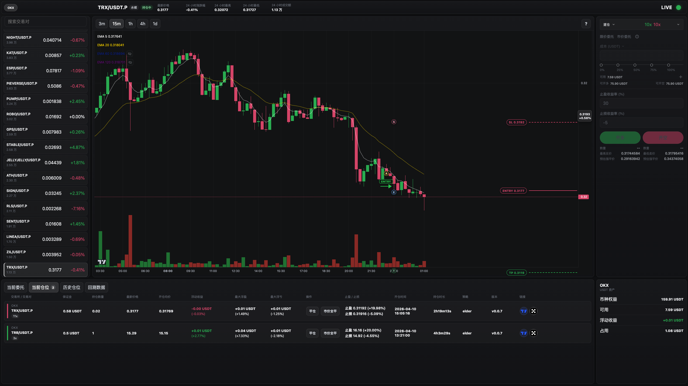
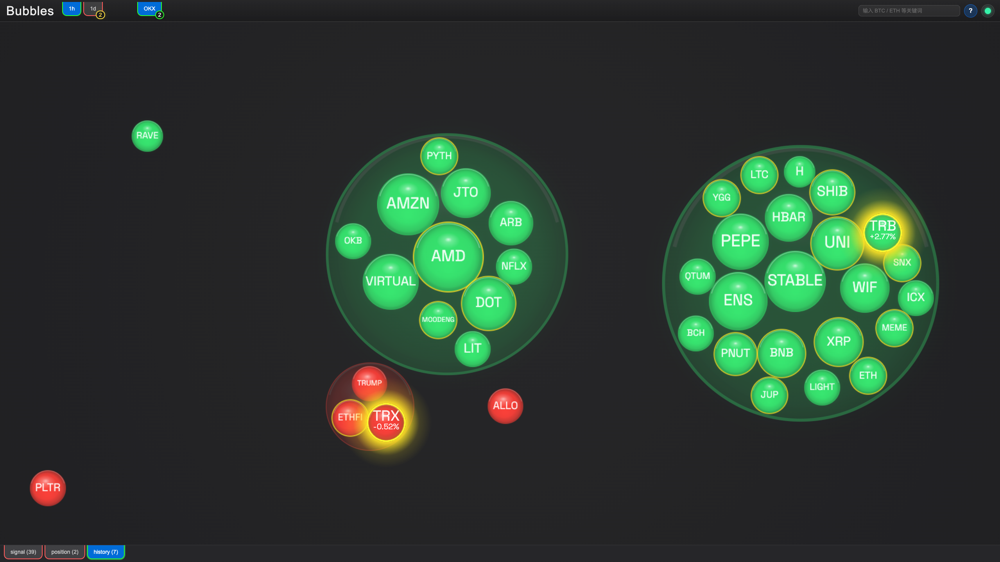

# tradingbot

English | [简体中文](./README.zh-CN.md)

`tradingbot` is a public, MIT-licensed extraction of a larger quantitative trading system.  
It currently exposes the runtime core, SQLite-backed storage, market/execution/risk pipeline, embedded exporter UIs, and the `turtle` strategy as the only public strategy implementation.

## Screenshots

### TradingView exporter



### Bubbles exporter



## Overview

- Go application with SQLite persistence and embedded frontend assets.
- Runtime modes for `init`, `live`, `paper`, `back-test`, `sql`, and `reset-cooldown`.
- Public strategy scope is intentionally limited to `turtle`.
- Exporter UIs include `bubbles`, `history`, and `tradingview`.
- Internal domains have been replaced with `example.com` placeholders for public release.

## Public Scope

Included in this repository:

- Runtime entrypoint in `app/`
- Core orchestration in `core/`
- Market and exchange abstractions in `exchange/`
- Risk and execution pipeline in `risk/` and `execution/`
- SQLite schema and runtime config bootstrap in `storage/`
- Embedded web exporters in `exporter/`
- Public strategy implementation in `strategy/turtle/`

Not included in the public repository:

- Private strategy implementations such as `strategy/elder/` and `strategy/simpleelder/`
- Internal design documents and most source-repo Markdown documentation
- Internal tools that are not part of the public runtime baseline

## Repository Layout

| Path | Purpose |
| --- | --- |
| `app/` | Program entrypoint and runtime mode wiring |
| `common/` | Shared utilities and transport helpers |
| `core/` | Strategy evaluation, snapshot assembly, live/back-test drivers |
| `exchange/` | Exchange config, market data adapters, runtime exchange plumbing |
| `execution/` | Back-test and live execution flow |
| `exporter/` | Embedded HTTP/WebSocket exporters and frontend apps |
| `iface/` | Cross-module interfaces |
| `internal/models/` | Shared domain models |
| `log/` | Zap + lumberjack logging integration |
| `risk/` | Signal lifecycle, trend guard, open/close filtering |
| `singleton/` | Single-instance lease and heartbeat |
| `storage/` | SQLite schema, defaults, and persistence |
| `strategy/turtle/` | Public strategy implementation |
| `ta/` | Technical analysis helpers |
| `third_party/go-talib/` | Vendored TA-Lib-compatible dependency |

## Requirements

- Go `1.22+`
- Node.js and npm if you want to rebuild frontend bundles
- A CGO-capable toolchain for native SQLite builds
- Docker or a Linux cross-compiler if you want to use `make linux` on macOS

## Quick Start

### 1. Initialize the database

```bash
go run app/main.go --mode=init
```

By default the application uses `./gobot.db`. You can override it with `-db`.

### 2. Run in paper mode

```bash
go run app/main.go --mode=paper
```

Or use the Makefile development entry:

```bash
make run
```

### 3. Run a back-test

```bash
go run app/main.go --mode=back-test -source=exchange:okx:btcusdtp:15m/1h:20260101_1200-20260115_1600
```

Back-test sources currently support:

- `exchange:...`
- `db:...`
- `csv:...`

### 4. Build the application

```bash
make build
```

This builds the current-platform binary into `build/` and copies the runtime shell scripts into the build output.

### 5. Build a Linux artifact

```bash
make linux
```

### 6. Pack a release artifact

```bash
make pack
```

## Frontend Exporters

The repository includes three embedded frontend applications:

- `exporter/bubbles`
- `exporter/history`
- `exporter/tradingview`

To rebuild them manually:

```bash
npm -C exporter/bubbles run build
```

```bash
npm -C exporter/history run build
```

```bash
npm -C exporter/tradingview run build
```

## Runtime Modes

| Mode | Description |
| --- | --- |
| `init` | Initialize schema and default runtime config |
| `live` | Live-trading runtime path |
| `paper` | Paper-trading runtime path |
| `back-test` | Historical replay and summary generation |
| `sql` | Execute ad hoc SQL against the SQLite database |
| `reset-cooldown` | Reset trade cooldown records for the current trade date |

## Configuration Notes

- Runtime configuration is stored in SQLite and bootstrapped by `-mode=init`.
- The default public strategy config only enables `turtle`.
- The default exporter address is `http://127.0.0.1:8081`.
- Public release placeholders use `example.com`; replace them with your own domains if you fork and deploy this project.

## Open Source Notes

- This repository is an extracted public baseline, not the full private system.
- Public syncs intentionally keep the runtime code and remove private strategies and internal documentation.
- The project is licensed under [MIT](./LICENSE).
